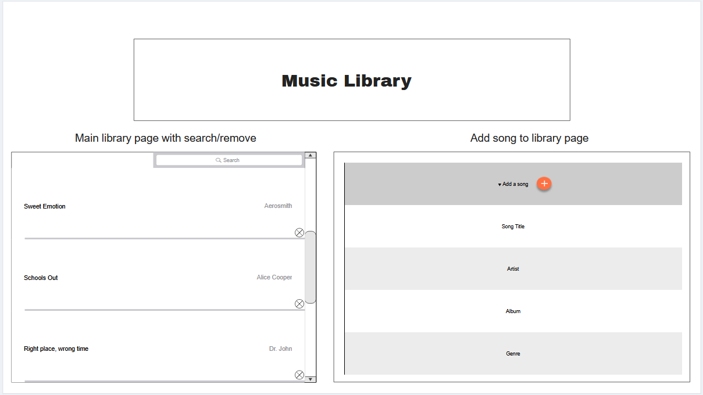

# CS408 Final Project - Music Library

## Project Spec

The general theme of this project is a music library web page. This web page will contain a library of all of the users favorite songs which can be fully curated by the user themselves. This could be useful for sharing libraries with other people, saving all of the users favorite songs for future playlist building, or purely for music tracking purposes.

The target audience of this web page would be music lovers of all kinds. Students, teachers, musicians, concert planners, tour managers, venues administration, and music enthusiasts. This universal target audience of this web page is what makes the possibilities larger than face value.

The library will contain all relevant information pertaining to the song or songs it is displaying. This information includes but is not limited to song title, artist, album, genre, length, user rating, users amount of plays, etc. The user will have the option to remove existing entries in the library as well as add a new entry containing all previously mentioned information. The user will also be able to apply a rating for each entry from one to five stars.

The main library portion will contain a search bar to make large libraries easily searchable  and will also contain alphabetical sorting as well as length sorting and sorting by rating.

Stretch goals would include the ability to share your library externally via email, social media, pdf, etc. This would allow users to create their own custom library and share that library with their friends or other people. Imagine your friends "Top 20 list of all time greatest songs."

## Project Wireframe

The basic level wire frame shows the main library portion listing all songs and relevant information with a search and remove option for each entry as well as an add content page to add more songs to the users library.

